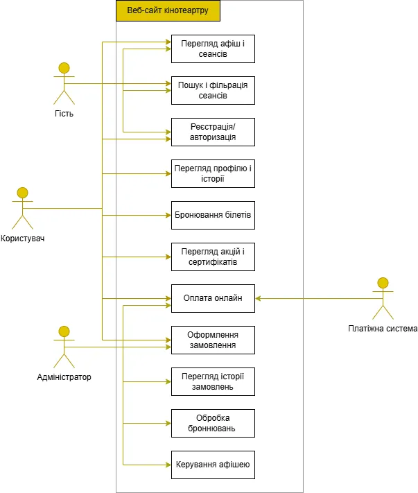
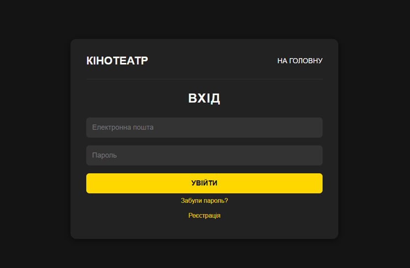

#  Лабораторна робота №10–11  
**Ігнатенко Ганна, ІПЗ-23**

---

## Завдання 1.1  
Сайт потрібен для того, щоб люди могли швидко дізнатися, які фільми йдуть у кінотеатрі, подивитися розклад, купити або забронювати квитки онлайн.  
Також на сайті можна буде переглянути акції та інформацію про прем’єри. Ми хочемо, щоб сайт був зручний у користуванні, щоб будь-хто міг без проблем знайти потрібний фільм і замовити квиток.

---

## Завдання 1.2

### Найменування й область застосування  
**“CinemaVerse”** – вебсайт для перегляду афіші, розкладу фільмів, бронювання квитків та перегляду інформації про сеанси (дата, ціна, опис фільму).

---

### Підстава для розробки  
Розробка проводиться в межах дисципліни **«Основи програмної інженерії»** студентами спеціальності ІПЗ (Інженерія програмного забезпечення).  
Документ створено відповідно до:
- ISO/IEC 25010 — Software and data quality  
- Agile Manifesto  
- Scrum Guide 2020  

---

### Призначення розробки  

#### Функціональне призначення  
Система забезпечує:
- Оновлення і перегляд афіші та розкладу фільмів  
- Бронювання та купівля квитків онлайн  
- Можливість авторизуватись і мати власний кабінет  
- Фільтрацію фільмів за жанром, датою або залою  

#### Експлуатаційне призначення  
- Система підтримує одночасну роботу декількох користувачів  
- Вебдодаток із доступом через різні браузери (Chrome, Firefox, Microsoft Edge)

---

### Технічні вимоги  

**Модулі:**
- Модуль авторизації  
- Модуль афіші фільмів  
- Модуль фільтрації розкладу (за датою, жанром, залом)  
- Модуль каталогу фільмів  
- Модуль бронювання квитків  
- Модуль онлайн оплати  

**Вимоги до функціональних характеристик:**

| № | Функція | Опис |
|---|----------|------|
| 1 | Реєстрація користувача | Створення особистого кабінету користувача |
| 2 | Швидка авторизація | Вхід за збереженим логіном, паролем або через Google |
| 3 | Перегляд афіші | Розклад фільмів, їх опис, жанр, назва, дата показу |
| 4 | Бронювання квитків | Вибір місця, під час вибору воно стає недоступним для інших |
| 5 | Фільтрація | Пошук за датою, жанром і залом |
| 6 | Онлайн оплата | Оплата різними банками, Google Pay |

---

### Вимоги до надійності  
- Автозбереження даних кожні 30 секунд  
- Обробка помилок користувацької та серверної частини  
- Не прийняття оплати без підтвердження через банк  

---

### Вимоги до експлуатації  
- **OS:** Windows 10 і більше, Linux, Mac  
- **Browser:** будь-який, але останні версії  
- **Інтернет:** не менше 1.5 Mbps  

---

### Вимоги до технічних засобів  
- Вимог немає, оскільки браузер тягне майже уся техніка  

---

### Сумісність  
- Підтримка сайту для мобільних пристроїв  
- Підтримка усіх сучасних браузерів  
- Можливість інтеграції з платіжними системами  

---

###  Мови і середовище розробки  
- React  
- React-router  
- Vite  
- TailwindCSS  
- CSS  
- SQLite3  

---

###  Технічно-економічні показники  

| Показник | Опис |
|-----------|------|
| Собівартість | 1200 USD (еквівалент 3 місяців роботи команди з 4 осіб) |
| Очікувана окупність | Після впровадження сайту у кінотеатр |
| Економічний ефект | Зменшення черг на 30–35% та збільшення прибутковості на 20–25% |

---

### Стадії та етапи розробки  

| Спринт | Тривалість | Основні завдання |
|---------|-------------|------------------|
| 1 | 2 тижні | Створити сторінку афіші, компонент фільму, макети моб/десктоп |
| 2 | 2 тижні | Створити сторінку сеансу, креслення залу, логіку резервування |
| 3 | 2 тижні | Підключити тестовий платіжний шлюз (sandbox), генерувати QR/PDF |
| 4 | 2 тижні | UI-Polish, документація, інструкції для розгортання |

---

### Порядок контролю та приймання  

**Види тестування:**
- Unit-тести  
- Integration-тести  
- UI-тести  
- Користувацьке тестування  

**ПЗ вважається прийнятим, якщо:**
- Проходить усі тести на 100%  
- Усі функції працюють коректно (оплата, бронювання тощо)  
- Дані зберігаються правильно  
- Сайт працює стабільно на ПК і мобільних пристроях  

---

### Додатки  
- Діаграма 

- Макет інтерфейсу 

---

### Очікуваний результат  
- Створений прототип вебсайту кінотеатру з онлайн оплатою  
- Тестові акаунти для користувачів та адміністратора  
- Документація  
